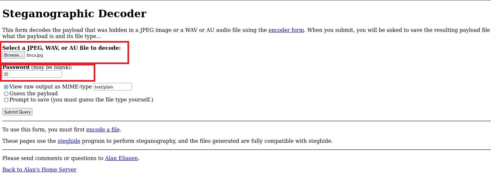
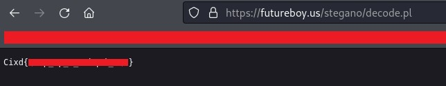
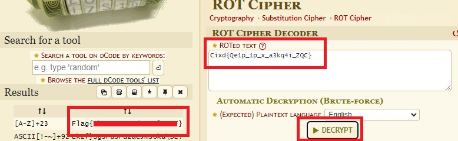

# WRITEUP CTF CaixaBank Tech - RETO 1


Competición CaixaBank Tech | Reto Esteganografía [1/2]


## TESIS DEL DESAFÍO
Iniciamos el reto viendo la siguiente imagen. En ella, se puede observar que en la boca falta una pieza. Se utilizaron varias herramientas para examinar los metadatos de la imagen y verificar si contenía algún archivo en su interior, pero no se obtuvieron resultados. Tras varias horas realizando otros retos de la competición, llegué a la conclusión de que la pieza que falta podría ser la contraseña para acceder a los archivos en el interior de la imagen principal. Así que busqué información acerca de la pieza que faltaba y era la número 35.

Se utilizó la herramienta online Steganographic Decoder:

https://futureboy.us/stegano/decinput.html

Si pulsamos el botón "Submit", nos dará un resultado que, como podemos ver, tiene formato de flag encriptado.

Una vez obtenida la flag encriptada, deberemos desencriptarla para que esté correctamente y se pueda entregar para obtener la puntuación en la competición. Para ello, utilizaremos una herramienta online de la página "dCode".

https://www.dcode.fr/rot-cipher

Una vez en la página, pondremos la flag codificada en el recuadro, pulsaremos el botón "Decrypt" y obtendremos el resultado en la parte izquierda de la pantalla.


**Créditos a [iHarzz ](https://daviiddpr.github.io/)**
