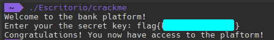

>Resoluciones de CTF's

# Resolución CTF CaixaBank Tech 07

## Ejecución de binario

Nos dan un binario llamado crackme, le damos permisos de ejecución

`chmod +x crackme`

Lo ejecutamos:


Vemos que nos pide una contraseña

## Ver cadenas legibles

Vamos a utilizar la utilidad strings antes de nada para ver si podemos ver alguna cadena que nos llame la atención:


Vemos algunas cadenas de texto interesantes:

- Welcome to the bank platform!  
- Enter your the secret key:    
- Congratulations! You now have access to the plaftorm!  
- Wrong key. I hope you are not a bank thief!
- ABCDEFGH
- IJKLMNOP
- QRSTUVWX
- YZabcdef
- ghijklmn 
- opqrstuv
- wxyz0123
- 456789+/
- PDY7PSEx 
- aSMFLGko 
- GkoIwUpa
- TkoaS4n
- xor_encrypt
- base64_encrypt

## Uso de ltrace

Ahora vamos a utilizar la herramienta `ltrace` para ver mas a fondo el programa como funciona por dentro:


Aqui podemos ver que cuando ponemos la contraseña "prueba" coge la longitud y tambien lo convierte en hexadecimal:

`strlen("prueba") = 6 `

`strdup("prueba") = 0x5b0d828fcb40`

Luego lo pasa a una cadena de texto y la compara con otra: 

`strcpy(0x5b0d828fcb40, "KigvPzg7")`

`strcmp("KigvPzg7", "PDY7PSExaSMFLGkoIwUpaTkoaS4n")`

## Analizar el binario con Ghidra

Habiendo visto esto vamos a usar `Ghidra` para ver el binario por dentro:

Abrimos la función "`main`":


1. Solicita una clave secreta al usuario.
2. Verifica la clave utilizando una función externa (`verify_key`).
3. Informa al usuario si la clave es correcta o incorrecta.

Vemos que nos pregunta la clave y la almacena en local_10, también vemos que llama a otra función `verify_key` , vamos a ver la función `verify_key` para ver como identifica si es valida o no:


La función `verify_key` realiza los siguientes pasos:

1. Inicializa una serie de variables con valores específicos en hexadecimal.
2. Duplica la clave proporcionada.
3. Cifra la clave duplicada llamdo a otras funciones (`xor_encrypt`, `base64_encrypt`)
4. Compara la clave cifrada con un valor interno predefinido.
5. Retorna `true` si la clave cifrada coincide con el valor predefinido, y `false` en caso contrario.

Esto es muy interesante ya que el valor con el que lo compara lo hemos podido ver antes con `ltrace`:

**PDY7PSExaSMFLGkoIwUpaTkoaS4n**

Solo nos queda decodificar esta cadena de la forma en la que codifica la clave que nosotros proporcionamos, para esto vamos a ver las funciones  `xor_encrypt` y `base64_encrypt`:

La función `base64_encrypt` simplemente encodea en base64

La función `xor_encrypt`:


Aplica la operación XOR entre el byte actual y el valor `0x5a`

## Creación del script para decodificar la cadena

Ahora que ya hemos visto como funciona la codificación vamos a hacer un script aplicando esto pero al reves para decodificarlo:

```python
import base64

# Las cadenas codificadas en base64 que se comparan con la entrada del usuario
encoded_strs = ["PDY7PSExaSMFLGkoIwUpaTkoaS4n"]

# La clave original
key = ""

# Para cada cadena codificada en base64
for encoded_str in encoded_strs:
    # Decodificar la cadena de base64
    decoded_str = base64.b64decode(encoded_str).decode('utf-8', 'ignore')

    # Realizar la operación XOR para obtener la parte de la clave original
    for i in range(len(decoded_str)):
        # Convertir cada carácter a su valor ASCII
        ascii_val = ord(decoded_str[i])
        # Realizar la operación XOR con 0x5a
        xor_val = ascii_val ^ 0x5a
        # Convertir el valor resultante de nuevo a un carácter
        char = chr(xor_val)
        # Comprobar si el carácter es imprimible
        if char.isprintable():
            # Añadir el carácter a la clave
            key += char

print("La flag es: " + key)
```

Ejecutamos el script:


Verificamos que sea esta:



**Ya tenemos la clave!!**