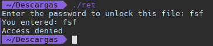
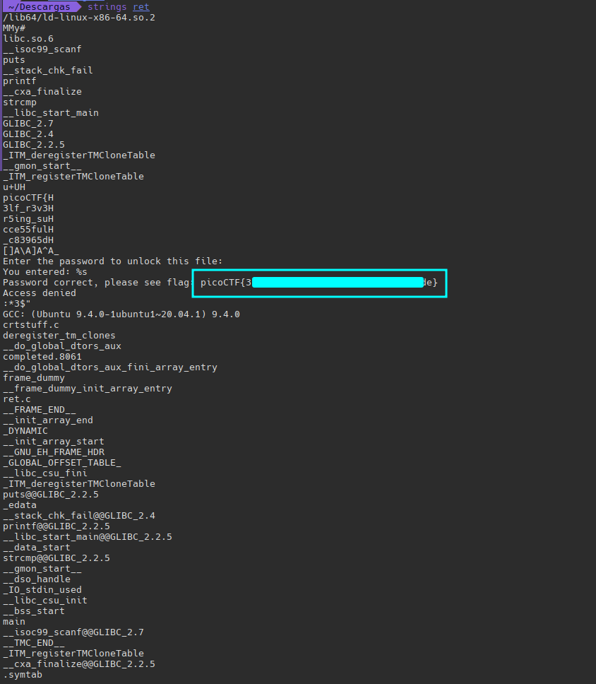

#### Description

Try reversing this file? Can ya? I forgot the password to this [file](https://artifacts.picoctf.net/c/270/ret). Please find it for me?

En este reto nos dan un `binario` llamado **ret**

Primero le damos permisos de ejecución

```shell
chmod +x ret
```

Lo ejecutamos:

```shell
./ret
```




Nos pide una contraseña

Vamos a mirar las cadenas hardcodeadas por si vemos algo interesante:

```shell
strings ret
```



Efectivamente ya tenemos la flag!