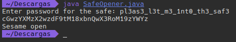

### Safe Opener 2


>Description
>What can you do with this file? I forgot the key to my safe but this [file](https://artifacts.picoctf.net/c/290/SafeOpener.class) is supposed to help me with retrieving the lost key. Can you help me unlock my safe?


En este reto nos dan un archivo `.java`

```java
import java.io.*;
import java.util.*;  
public class SafeOpener {
    public static void main(String args[]) throws IOException {
        BufferedReader keyboard = new BufferedReader(new InputStreamReader(System.in));
        Base64.Encoder encoder = Base64.getEncoder();
        String encodedkey = "";
        String key = "";
        int i = 0;
        boolean isOpen;
        

        while (i < 3) {
            System.out.print("Enter password for the safe: ");
            key = keyboard.readLine();

            encodedkey = encoder.encodeToString(key.getBytes());
            System.out.println(encodedkey);
              
            isOpen = openSafe(encodedkey);
            if (!isOpen) {
                System.out.println("You have  " + (2 - i) + " attempt(s) left");
                i++;
                continue;
            }
            break;
        }
    }
    
    public static boolean openSafe(String password) {
        String encodedkey = "cGwzYXMzX2wzdF9tM18xbnQwX3RoM19zYWYz";
        
        if (password.equals(encodedkey)) {
            System.out.println("Sesame open");
            return true;
        }
        else {
            System.out.println("Password is incorrect\n");
            return false;
        }
    }
}
```


En el código podemos ver que tenemos un objeto que codifica cadenas en `base64`  eso nos da una pista de por donde va el programa

`Base64.Encoder encoder = Base64.getEncoder();`

También podemos ver que nos pide una contraseña y la almacena en key:

`System.out.print("Enter password for the safe: ");`
`key = keyboard.readLine();`

Ahora esta key la codifica en `base64` 

`encodedkey = encoder.encodeToString(key.getBytes());`
`System.out.println(encodedkey);`

Mas adelante para verificar que la contraseña sea correcta la compara con una cadena:

`String encodedkey = "cGwzYXMzX2wzdF9tM18xbnQwX3RoM19zYWYz";`

```java
if (password.equals(encodedkey)) {
            System.out.println("Sesame open");
            return true;
```

Perfecto ya hemos visto como funciona la verificación, sabemos que compara una cadena codificada en `base64` con otra cadena hardcodeada por lo que intuimos que esta cadena también esta en `base64` por lo que si la decodificamos encontraremos la contraseña:

```shell
echo 'cGwzYXMzX2wzdF9tM18xbnQwX3RoM19zYWYz' | base64 -d
```




Vemos que la contraseña es correcta!

Ya tenemos la flag!