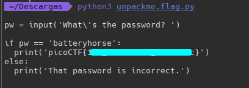

#### Description

Can you get the flag? Reverse engineer this [Python program](https://artifacts.picoctf.net/c/49/unpackme.flag.py).

Vamos a ver el programa:

```python
import base64
from cryptography.fernet import Fernet


payload = b'gAAAAABkzWGSzE6VQNTzvRXOXekQeW4CY6NiRkzeImo9LuYBHAYw_hagTJLJL0c-kmNsjY33IUbU2IWlqxA3Fpp9S7RxNkiwMDZgLmRlI9-lGAEW-_i72RSDvylNR3QkpJW2JxubjLUC5VwoVgH62wxDuYu1rRD5KadwTADdABqsx2MkY6fKNTMCYY09Se6yjtRBftfTJUL-LKz2bwgXNd6O-WpbfXEMvCv3gNQ7sW4pgUnb-gDVZvrLNrug_1YFaIe3yKr0Awo0HIN3XMdZYpSE1c9P4G0sMQ=='

key_str = 'correctstaplecorrectstaplecorrec'
key_base64 = base64.b64encode(key_str.encode())
f = Fernet(key_base64)
plain = f.decrypt(payload)
exec(plain.decode())
```

Vamos a ejecutarlo:


Vemos que se en-codea una cadena de texto y luego con `exec` se ejecuta

Vamos a probar a cambiar el `exec` a un `print` para que en vez de ejecutar la cadena nos la muestre por pantalla y podamos ver de que trata mejor el programa:

```python
print(plain.decode())
```



Ya tenemos la flag!