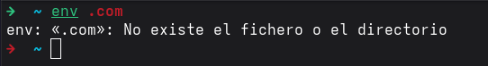

# Domain of Doom Revenge

## Description
*You're querying domains, but some lead to dangerous places*

- *The flag is hidden in an environment variable.*

## Solve

They provided us with the source code of the web application.

Here, we can see a regular expression that attempts to sanitize the input, which is then inserted into the following command: `dig +short -t A {your_input}`. Due to the malformed regex, we can bypass it and achieve command injection.


As I illustrated above, the first dot (`.`) in the regex is not escaped, which allows us to input the `;` character to concatenate our own command. For example, we can use the `env` command to print environment variables. However, our input must end with a valid top-level domain such as `.com` or `.org`



The command `env .com` doesn't work as expected because the `.com` argument causes `env` to misinterpret the command.

When inspecting the parameters available for `env`, we notice the `-u` option, which unsets the given environment variable and then executes the specified command. If no command is provided, `env` will simply print all current environment variables.


So, the final payload will look like:

```
test;env -u .com
```

